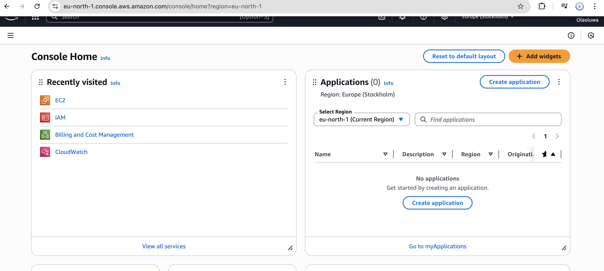

# Tech Environment Setup

In this project, i'll be taking screenshots of all the tools installed for all our projects 

## Visual Studio Code
### `visual studio` code is a free, lightweight code editor used to write, edit, debug and manage code, work with `Git/GitHub` and create documentation all in one place

## GIT `version control`
### `git` is used for tracking changes in code, collaborating with others, and managing different versions of a projects.

## Virtual Box
### `virtual box` is used to create and run virtual machines- it lets you run another operating system like linux, windows, or mac OS inside your current computer without replacing your main OS

## Ubuntu 
### `ubuntu` is a free, open-source Linux operating system used for running servers, developing software, learning linuxx, and genral computing like browsing, coding, or office work

## GitHub
### `GitHub` is used for storing, sharing, and collaborating on code projects online using git or version control 

## AWS
### `AWS` is used for hosting applications, storing data, running servers, and proving cloud -based tools so businesses can build and scale services without managing physical hardware

